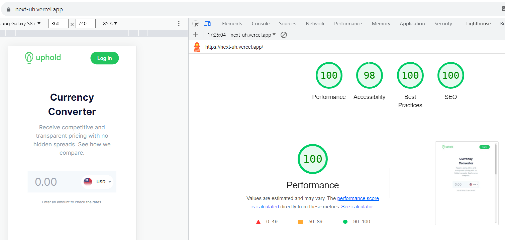

This is a [Next.js](https://nextjs.org/) project bootstrapped with [`create-next-app`](https://github.com/vercel/next.js/tree/canary/packages/create-next-app).

## Getting Started

First, run the development server:

```bash
npm run dev
# or
yarn dev
# or
pnpm dev
# or
bun run dev
```

## About the project

My alternative Uphold challenge. The goal was to be able to deploy a fully functional solution. Here, instead of using the Uphold SDK I'm using the company's API in combination with Next's new fetch API and server action features in order to avoid CORS issues.

## Google Lighthouse scores for the project:



The low level of contrast between some font colors and the background is preventing a perfect score on Accessibility.
